# IMU 惯性测量单元

## 移植常见问题：

1. STM32CubeMX添加DSP库
      1. 点击[Software Packs]/[Select Components]，在[Software Packs Component Selector]窗口，勾选[STMicroelectronicsX-CUBE-ALGOBUILD]/[DSP Library Library]/[DSP Library 1.3.0];

         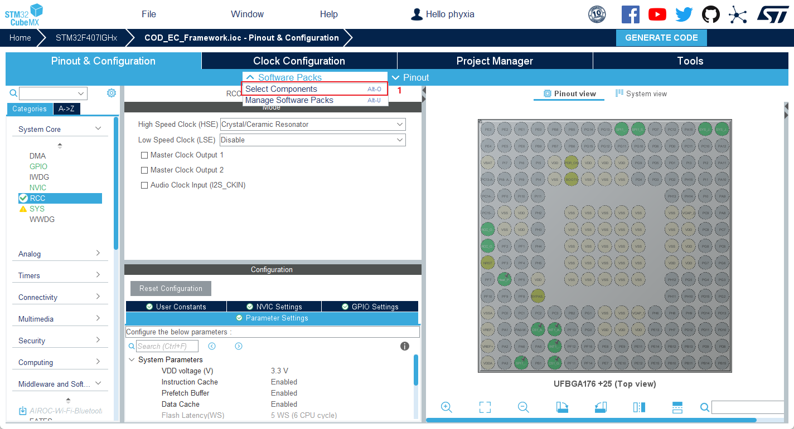

         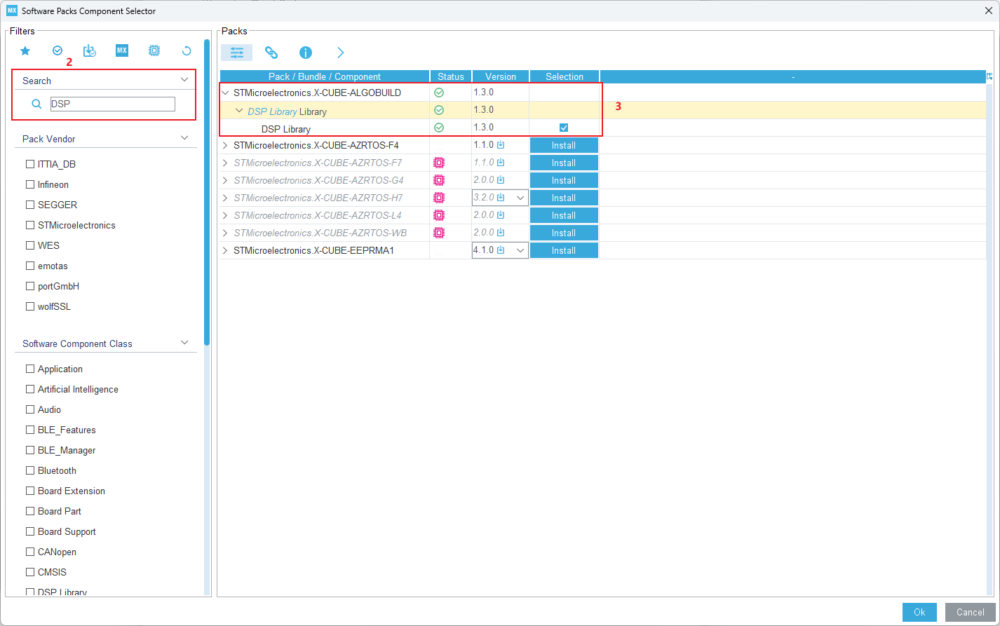

      2. 关闭[Software Packs Component Selector]窗口，在[Middle and Software Packs]/[X-CUBE-ALGOBUILD]栏勾选[DSP Library Library]；

         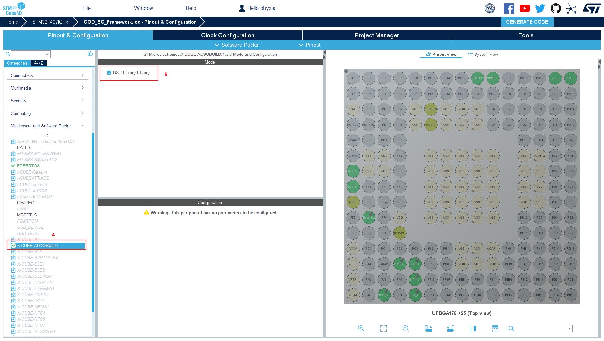

      3. 此时在工程中默认添加的LIB文件为`arm_cortexM4l_math.lib`(Little endian on Cortex-M4)，而实际需求为`arm_cortexM4lf_math.lib `(Little endian and Floating Point Unit on Cortex-M4)，后者支持浮点单元。

         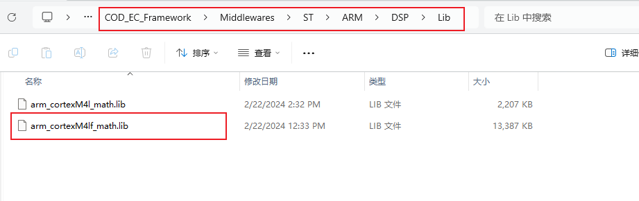

         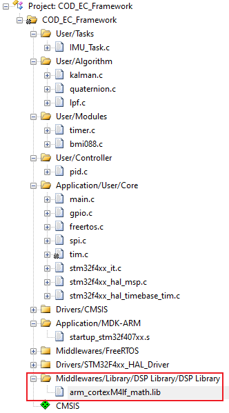

2. malloc函数申请内存失败
     在startup_stm32f407xx.s中默认分配的堆空间只有`0x0200`个字节，而在初始化扩展卡尔曼滤波器时所需要的空间超过了0x0200，需要在STM32CubeMX的[Project Manager]/[Project]/[Linker Settings]栏修改`Minimum Heap Size`的值以达到使用需求，修改后可在startup_stm32f407xx.s文件中的`Heap_Size`体现。

     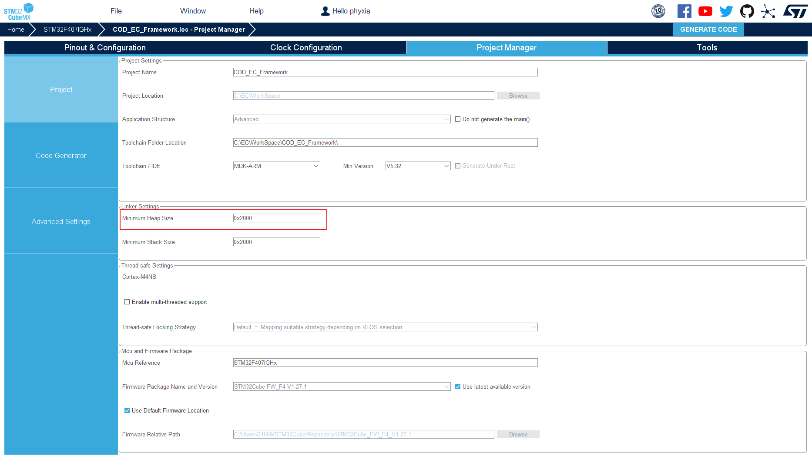

     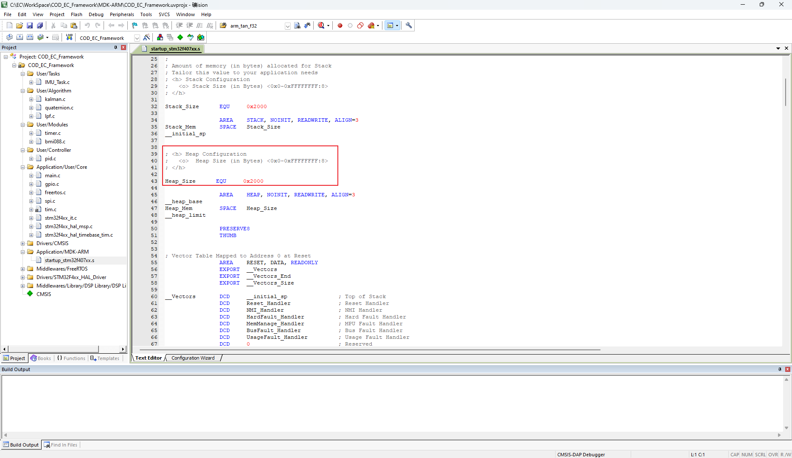

## 陀螺仪积分均值补偿

1. 使能积分

   在`bmi088.h`中修改宏定义`IMU_Calibration_ENABLE`为1.

   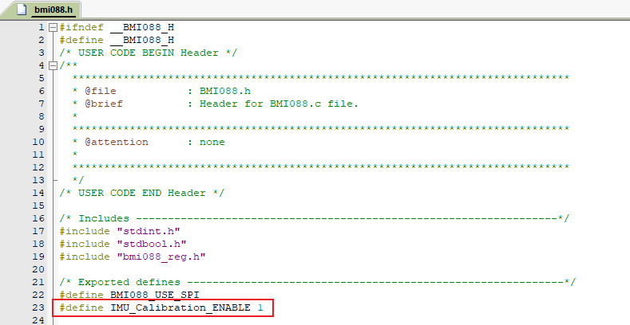

2. 运行工程，通过Watch Windows查看`BMI088_Info`结构体中的`temperature`数值，待其稳定后先后点击**Stop**键、**Reset**键和**Run**键，等待`offset`数据更新.

   

   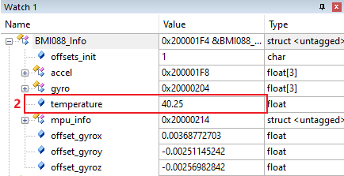

   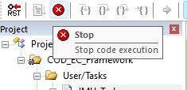

   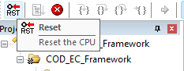

   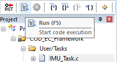

3. 等待`offset`数值稳定后，重复步骤2求得offset均值，写入`bmi088.c`的`BMI088_Offset_Update`函数内，失能积分。

   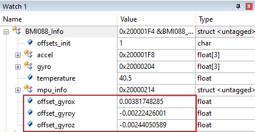

   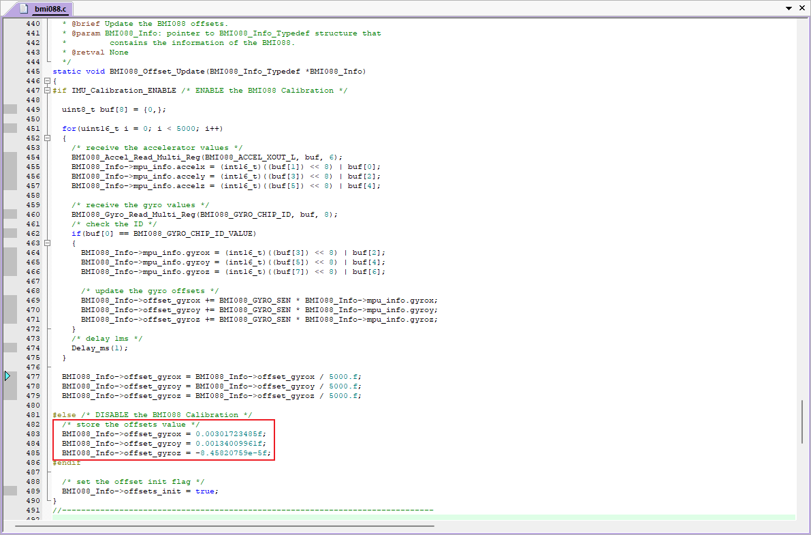

   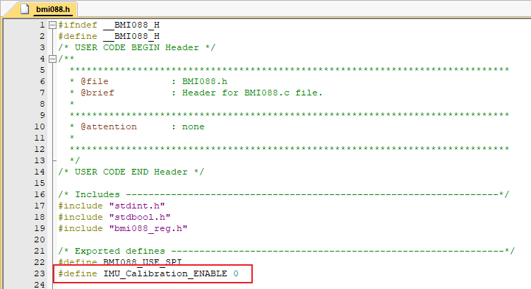