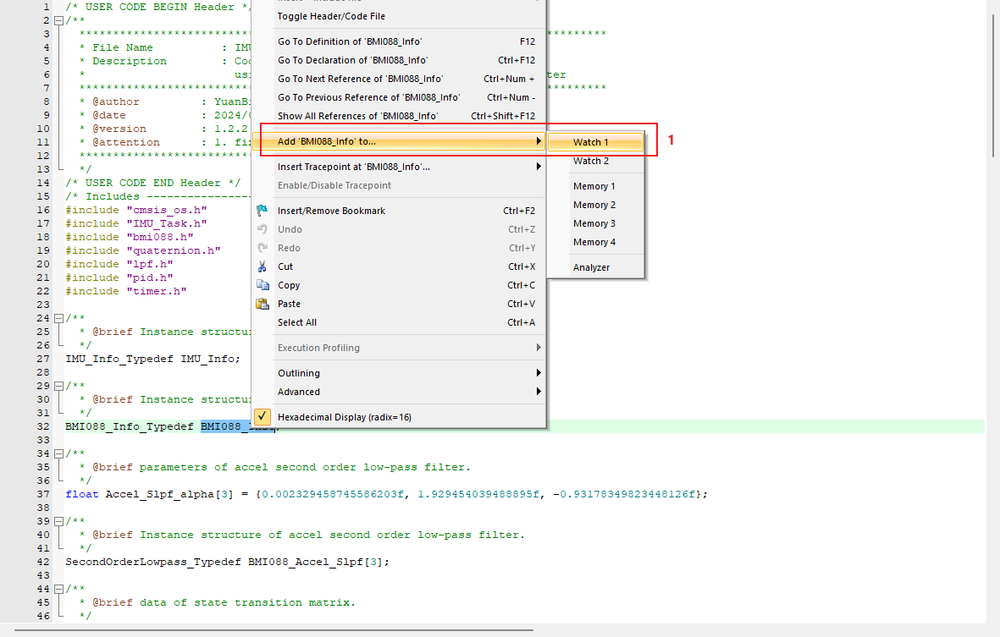

# IMU 惯性测量单元

## 姿态解算

### 欧拉角与旋转矩阵

详情见[欧拉角、四元数、旋转矩阵推到及相互关系](https://zhaoxuhui.top/blog/2018/03/13/RelationBetweenQ4&R&Euler.html)。

根据欧拉旋转定理，任何一个旋转都可以用三个旋转的参数来表示。

$$
Rx(\theta)=\begin{bmatrix}
  1 & 0 & 0 \\
  0 & cos(\theta) & -sin(\theta) \\
  0 & sin(\theta) & cos(\theta)
\end{bmatrix} \\
$$

$$
Ry(\gamma)=\begin{bmatrix}
  cos(\gamma) & 0 & sin(\gamma) \\
  0 & 1 & 0 \\
  -sin(\gamma) & 0 & cos(\gamma)
\end{bmatrix} \\
$$

$$
Rz(\phi)=\begin{bmatrix}
  cos(\phi) & -sin(\phi) & 0 \\
  sin(\phi) & cos(\phi)  & 0 \\
  0 & 0 & 1
\end{bmatrix}
$$

使用matlab符号函数工具求旋转矩阵$R=RzRyRx$的符号解，使用$Sx，Cx，Sy，Cy，Sz，Cz$分别代表三轴旋转的正弦、余弦分量。

```matlab
syms R Rx Ry Rz Sx Sy Sz Cx Cy Cz

Rx=[1 0 0;0 Cx -Sx;0 Sx Cx]；
Ry=[Cy 0 Sy;0 1 0;-Sy 0 Cy]；
Rz=[Cz -Sz 0;Sz Cz 0;0 0 1]；

R=Rz*Ry*Rx
```

$$
R=\begin{bmatrix}
  cos(\gamma)cos(\phi) & cos(\phi)sin(\theta)sin(\gamma)-cos(\theta)sin(\phi) & sin(\theta)sin(\phi)+cos(\theta)cos(\phi)sin(\gamma) \\
  cos(\gamma)sin(\phi) & cos(\theta)cos(\phi)+sin(\theta)sin(\gamma)sin(\phi) & cos(\theta)sin(\gamma)sin(\phi)-cos(\phi)sin(\theta) \\
  -sin(gamma) & cos(\gamma)sin(\theta) & cos(\theta)sin(\gamma)
\end{bmatrix}
$$

#### 动态欧拉角旋转中的万向锁问题

详情见[3D数学：欧拉角、万向锁、四元数](https://www.cnblogs.com/HDDDDDD/p/15067619.html)

定义：以固定顺序旋转，角度为±90°的第二次旋转将使得第一次和第三次旋转的旋转轴相同。

以`X-Y-Z`的顺序旋转为例，用矩阵的形式表示如下

$$
\begin{align}
E(\alpha，\frac{\pi}{2}，\beta)&=Rz(\beta)Ry(\frac{\pi}{2})Rx(\alpha) \\
&=\begin{bmatrix}
  cos(\beta) & -sin(\beta) & 0 \\
  sin(\beta) &  cos(\beta)  & 0 \\
  0 & 0 & 1
\end{bmatrix}\begin{bmatrix}
  0 & 0 & 1 \\
  0 & 1 & 0 \\
  -1 & 0 & 0
\end{bmatrix}\begin{bmatrix}
  1 & 0 & 0 \\
  0 & cos(\alpha) & -sin(\alpha) \\
  0 & sin(\alpha) &  cos(\alpha)
\end{bmatrix} \\
&=\begin{bmatrix}
  0 & sin(\alpha-\beta) &  cos(\alpha-\beta) \\
  0 & cos(\alpha-\beta) & -sin(\alpha-\beta) \\
  -1 & 0 & 0
\end{bmatrix} \\
&=\begin{bmatrix}
  0 & 0 & 1 \\
  0 & 1 & 0 \\
  -1 & 0 & 0
\end{bmatrix}\begin{bmatrix}
  1 & 0 & 0 \\
  0 & cos(\alpha-\beta) & -sin(\alpha-\beta) \\
  0 & sin(\alpha-\beta) &  cos(\alpha-\beta)
\end{bmatrix} \\
&=Ry(\frac{\pi}{2})Rx(\alpha-\beta)
\end{align}
$$

三个旋转矩阵所组成的变换化简成了两个变换矩阵，即分别对x-y-z三轴进行了旋转，但y轴上的变换角使得z轴与原来x轴重合，就没有任何办法对最初的z轴进行旋转了。

### 四元数

详情见[四元数与三维旋转](https://krasjet.github.io/quaternion/quaternion.pdf)

四元数的定义和复数非常类似，唯一的区别就是四元数一共有三个虚部。

$$
q=a+bi+cj+dk， (a，b，c，d \in R)
$$

其中

$$
i^2=j^2=k^2=ijk=-1
$$

四元数其实就是对$\{1， i， j， k\}$的线性组合，其向量形式为$q=\begin{bmatrix}
  a \\
  b \\
  c \\
  d
\end{bmatrix}$

除此之外，经常将四元数的实部与虚部分开，用一个三维的向量来表示虚部，将其表示为标量和向量的有序对形式

$$
q=[s，v]，
v=\begin{bmatrix}
  x \\
  y \\
  z
\end{bmatrix}，(s，x，y，z \in R)
$$

#### 四元数与3D旋转

一个向量v沿着一个用单位向量所定义的旋转轴u旋转θ度， 将向量v拆分为正交于旋转轴u的$v_{\perp}$，和平行于旋转轴u的$v_{\parallel}$，将这两个向量分别进行旋转得到${v_{\perp}}'和{v_{\parallel}}'$，将其相加就是v旋转后的结果${v}'={v_{\perp}}'+{v_{\parallel}}'$。

将上述向量定义为纯四元数

$$
\begin{align}
v&=[0，\vec{v}]，{v}'=[0，{\vec{v}}'] \\
v_{\perp}&=[0，\vec{v}_{\perp}]，v_{\parallel}=[0，\vec{v}_{\parallel}] \\
{v_{\perp}}'&=[0，{\vec{v}_{\perp}}']，{v_{\parallel}}'=[0，{\vec{v}_{\parallel}}'] \\
u&=[0，\vec{u}]
\end{align}
$$

对$v_{\perp}和v_{\parallel}$分别讨论

##### $v_{\perp}$的旋转

${v_{\perp}}$正交于旋转轴，即

$$
{\vec{v}_{\perp}}' = cos(\theta)\vec{v}_{\perp}+sin(\theta)(\vec{u} \times \vec{v}_{\perp})
$$

依据纯四元数的性质，$uv_{\perp}=[-\vec{u}·\vec{v}_{\perp}，\vec{u}\times \vec{v}_{\perp}]$

又$u和v_{\perp}$正交，即$\vec{u}·\vec{v}_{\perp}=0$

则$uv_{\perp}=[0，\vec{u}\times \vec{v}_{\perp}]=\vec{u}\times \vec{v}_{\perp}$

代入可得

$$
{v_{\perp}}' = cos(\theta)v_{\perp}+sin(\theta)(uv_{\perp})
$$

由四元数乘法分配律，上式可变换为

$$
{v_{\perp}}' = (cos(\theta)+sin(\theta)u)v_{\perp}
$$

将$cos(\theta)+sin(\theta)u$看作一个四元数，则可以将旋转写作四元数的乘积，至此已经将旋转与四元数关联起来了。

令$q=cos(\theta)+sin(\theta)u$，可得${v_{\perp}}' = qv_{\perp}$，将定义的纯四元数u代入q得

$$
\begin{align}
q&=cos(\theta) + sin(\theta) u\\
&=[cos(\theta)，0] + sin(\theta)[0，U] \\
&=[cos(\theta)，sin(\theta)U]
\end{align}
$$

也就是说，如果旋转轴的坐标系$\vec{u}=\begin{bmatrix} u_x\\
 u_y\\
 u_z
\end{bmatrix}$，旋转角为$\theta$，那么完成此次旋转的四元数q可以定义为

$$
q=cos(\theta)+sin(\theta)u_xi+sin(\theta)u_yj+sin(\theta)u_zk;
$$

这个四元数$q$为单位四元数

$$
\begin{align}
\parallel q\parallel &=\sqrt{cos^2(\theta)+(sin(\theta)\vec{u}·sin(\theta)\vec{u})}  \\
&=\sqrt{cos^2(\theta)+(sin^2(\theta)\vec{u}·\vec{u})} \\
&=\sqrt{cos^2(\theta)+(sin^2(\theta)\parallel \vec{u}\parallel ^2)} ， (\parallel \vec{u}\parallel ^2=1) \\
&=\sqrt{cos^2(\theta)+(sin^2(\theta)}
&=1
\end{align}
$$

因为$\parallel q\parallel=1$，即它所代表的变换并不会对原向量进行缩放，是一个纯旋转。

##### $v_{\parallel}$的旋转

平行于旋转轴的$v_{\parallel}$，旋转不会对它作出任何的变换

$$
{v_{\parallel}}'=v_{\parallel}
$$

##### v的旋转

综上所述，可以得到${v}'$的结果

$$
\begin{align}
{v}'&= {v_{\parallel}}'+{v_{\perp}}' \\
    &=  v_{\parallel} + qv_{\perp}
\end{align}
$$

$q=[cos(\theta)，sin(\theta)\vec{u}]$，且$\vec{u}$为单位向量，那么$q^2=qq=[cos(2\theta)，sin(2\theta)\vec{u}]$

再根据四元数的逆的定义$qq^{-1}=1$，令$q=p^2$，对旋转公式进行变形

$$
\begin{align}
{v}' &= v_{\parallel} + qv_{\perp} \\
 &= 1·v_{\parallel}+qv_{\perp} \\
 &=pp^{-1}v_{\parallel}+ppv_{\perp}
\end{align}
$$

在这里引入了一个新的四元数$p=[cos(\frac{\theta}{2})，sin(\frac{\theta}{2})\vec{u}]$，易知$\parallel p\parallel=1$，p也是一个单位四元数，即$p^{-1}=p*$，($p^*$是$p$的共轭)
。

由四元数的性质可知

假设$v_{\parallel}=[0，\vec{v}_{\parallel}]$是一个纯四元数，$q=[\alpha，\beta \vec{u}]$，其中$\vec{u}$是一个单位向量，$\alpha，\beta \in R$，如果$\vec{v}_{\parallel}$平行于$\vec{u}$，那么$qv_{\parallel}=v_{\parallel}q$

假设$v_{\perp}=[0，\vec{v}_{\perp}]$是一个纯四元数，$q=[\alpha，\beta \vec{u}]$，其中$\vec{u}$是一个单位向量，$\alpha，\beta \in R$，如果$\vec{v}_{\perp}$正交于$\vec{u}$，那么$qv_{\perp}=v_{\perp}q^*$

现在，可以对之前的公式做出最后的变形

$$
\begin{align}
{v}' &= pp^*v_{\parallel}+ppv_{\perp} \\
&=pv_{\parallel}p^*+pv_{\perp}p^* \\
&=p(v_{\parallel}+v_{\perp})p^* \\
&=pvp^*
\end{align}
$$

综上，对于任意向量$v$沿着以单位向量定义的旋转轴$u$旋转$\theta$度之后的${v}'$,可以使用四元数乘法来获得，令$v=[0,\vec{v}]，q=[cos(\frac{\theta}{2})，sin(\frac{\theta}{2})\vec{u}]$，那么

$$
{v}'=qvq^*=qvq^{-1}
$$

#### 四元数微分方程

对于机体的姿态解算需要实时更新四元数，构建四元数关于时间的微分方程，通过一阶龙格-库塔法(Runge-Kutta methods)进行求解获得四元数更新方程。


$q=[cos(\frac{\theta}{2})，sin(\frac{\theta}{2})\vec{u}]=\begin{bmatrix}
  q_0 \\
  q_1 \\
  q_2 \\
  q_3
\end{bmatrix}$，对时间t进行微分

$$
\begin{align}
\frac{\mathrm{d}q}{\mathrm{d}t} &= -\frac{1}{2}sin{\theta}\frac{\mathrm{d}\theta}{\mathrm{d}t}+\frac{1}{2}cos(\frac{\theta}{2})\frac{\mathrm{d}\theta}{\mathrm{d}t}\vec{u}+sin(\frac{\theta}{2})\frac{\mathrm{d}\vec{u}}{\mathrm{d}t} \\
&=\frac{1}{2}\frac{\mathrm{d}\theta}{\mathrm{d}t}(cos(\frac{\theta}{2})\vec{u}-sin(\frac{\theta}{2})) \\
&=\frac{1}{2}\frac{\mathrm{d}\theta}{\mathrm{d}t}\vec{u}(cos(\frac{\theta}{2})+sin(\frac{\theta}{2})\vec{u}) \\
&=\frac{1}{2} \vec{\omega} \vec{u}q \\
&=\frac{1}{2}(0+\omega_xi+\omega_yj+\omega_zk)(q_0+q_1i+q_2j+q_3k)

\end{align} 
$$

转为矩阵形式

$$
\frac{\mathrm{d}q}{\mathrm{d}t} = \frac{1}{2} \begin{bmatrix}
0 & -\omega_x & -\omega_y & -\omega_z \\
\omega_x & 0 & \omega_z & -\omega_y \\
\omega_y & -\omega_z & 0 & \omega_x \\
\omega_z &  \omega_y & -\omega_x & 0 \\
\end{bmatrix}\begin{bmatrix}
  q_0 \\
  q_1 \\
  q_2 \\
  q_3
\end{bmatrix}
$$

##### 一阶龙格-库塔法

对应[欧拉方法](https://zh.wikipedia.org/zh-cn/%E6%AC%A7%E6%8B%89%E6%96%B9%E6%B3%95)，对微分方程${y}'=f(t，y(t))，y(t_0)=y_0$，用$y$在点$ (t,y(t)) $附近的线性近似来得到其近似解，利用时间$t_n$时的数值，单步的欧拉方法，可得到时间$t_{n+1}=t_n+h$时的近似值如下

$$
y_{n+1}=y_n+hf(t_n，y_n)
$$

代入上述四元数微分方程，可以得到四元数更新方程如下

$$
\begin{bmatrix}
  q_0 \\
  q_1 \\
  q_2 \\
  q_3
\end{bmatrix}_{t_n+\Delta t}=\begin{bmatrix}
  q_0 \\
  q_1 \\
  q_2 \\
  q_3
\end{bmatrix}_{t_n}+\frac{1}{2}\Delta t\begin{bmatrix}
0            & -\omega_x q_1 & -\omega_y q_2 & -\omega_z q_3 \\
\omega_x q_0 & 0             & \omega_z  q_2 & -\omega_y q_3 \\
\omega_y q_0 & -\omega_z q_1 & 0             & \omega_x  q_3 \\
\omega_z q_0 &  \omega_y q_1 & -\omega_x q_2 & 0 \\
\end{bmatrix}
$$

### 传感器数据融合

详情参照[Mahony姿态解算算法笔记(一)](https://www.cnblogs.com/WangHongxi/p/12357230.html)

由四元数可以得到从世界坐标系转换到机体坐标系的姿态转换矩阵$R^b_W$

$$
R^b_W=\begin{bmatrix}
1-2(q_2^2+q_3^2) & 2(q_1q_2+q_0q_3) & 2(q_1q_3-q_0q_2) \\
2(q_1q_2-q_0q_3) & 1-2(q_1^2+q_3^2) & 2(q_2q_3+q_0q_1) \\
2(q_1q_3+q_0q_2) & 2(q_2q_3-q_0q_1) & 1-2(q_1^2+q_2^2)
\end{bmatrix}
$$

使用向量$\vec{g}$结合上述姿态转换矩阵得到机体坐标系下重力加速度向量的归一化理论值

$$
\hat{a}=\begin{bmatrix}
 \hat{a_x} \\
 \hat{a_y} \\
 \hat{a_z}
\end{bmatrix}= R^b_W \vec{g}=R^b_W\begin{bmatrix}
 0 \\
 0 \\
 1
\end{bmatrix}=\begin{bmatrix}
 2(q_1q_3-q_0q_2) \\
 2(q_2q_3+q_0q_1) \\
 1-2(q_1^2+q_2^2)
\end{bmatrix}
$$

通过加速度计可以得到重力加速度向量的归一化测量值

$$
\bar{a}=\begin{bmatrix}
 \bar{a_x} \\
 \bar{a_y} \\
 \bar{a_z}
\end{bmatrix} =\begin{bmatrix}
 \frac{a^{real}_x}{{a^{real}_x}^2+{a^{real}_y}^2+{a^{real}_z}^2} \\
 \frac{a^{real}_y}{{a^{real}_x}^2+{a^{real}_y}^2+{a^{real}_z}^2} \\
 \frac{a^{real}_z}{{a^{real}_x}^2+{a^{real}_y}^2+{a^{real}_z}^2} \\
\end{bmatrix}
$$

上述理论值和测量值之前必然存在误差，这个偏差很大程度上是由陀螺仪数据产生的角速度误差引起的，因此根据理论值和测量值之间的误差就可以补偿陀螺仪数据的误差，进而解算出较为准确的姿态。

理论重力加速度向量和实际重力加速度向量均是向量，反应向量间夹角关系的运算有两种：内积（点乘）和外积（叉乘），考虑到向量外积模的大小与向量夹角呈正相关，故通过计算外积来得到向量方向差值$\vec{e}$

$$
\vec{e}=\hat{a}\times \bar{a}=\begin{bmatrix}
\bar{a_y}\hat{a_z}-\bar{a_z}\hat{a_y} \\
\bar{a_z}\hat{a_x}-\bar{a_x}\hat{a_z} \\
\bar{a_x}\hat{a_y}-\bar{a_y}\hat{a_x}
\end{bmatrix}
$$

获得误差后，通过构建PI控制器来计算角速度补偿值。

### EKF

详情参照[四元数EKF姿态更新算法](https://zhuanlan.zhihu.com/p/454155643)

综合上述模型，定义状态向量

$$
x=\begin{bmatrix}
  q_0 \\
  q_1 \\
  q_2 \\
  q_3 \\
  {\omega}_x^{bias} \\
  {\omega}_y^{bias}
\end{bmatrix}
$$

其中$\begin{bmatrix}
  q_0 \\
  q_1 \\
  q_2 \\
  q_3 
\end{bmatrix}$为机体坐标系相对于惯性坐标系的姿态四元数，$\begin{bmatrix}
{\omega}_x^{bias} \\
{\omega}_y^{bias}
\end{bmatrix}$为陀螺仪的误差模型，$\omega^{real}=\omega^{measure}-\omega^{bias}$


状态更新方程如下

$$
\begin{align}
x_{k+1} &= f(x_k)+w_k \\
&=\begin{bmatrix}
q_k+\frac{1}{2}\Delta t(\vec{\omega}^{measure}-\vec{\omega}^{bias})q_k  \\
\omega^{bias}_k 
\end{bmatrix}+w_k
\end{align}
$$

其中白噪声$w_k \sim N(0_{6\times 1},Q)$，$\vec{\omega}^{bias}$为陀螺仪零漂组成的矩阵

观测向量为$z=\begin{bmatrix}
 a_x \\
 a_y \\
 a_z
\end{bmatrix}$，观测方程如下

$$
\begin{align}
z_k&=h(x_k)+v_k，v_k \sim N(0_{3\times 1},R) \\
&=\begin{bmatrix}
 2(q_1q_3-q_0q_2) \\
 2(q_2q_3+q_0q_1) \\
 1-2(q_1^2+q_2^2)
\end{bmatrix}+v_k
\end{align}
$$


使用matlab符号函数工具可求得状态模型和量测模型的雅可比矩阵。

## 移植常见问题：

1. STM32CubeMX添加DSP库
      1. 点击[Software Packs]/[Select Components]，在[Software Packs Component Selector]窗口，勾选[STMicroelectronicsX-CUBE-ALGOBUILD]/[DSP Library Library]/[DSP Library 1.3.0];

         

         

      2. 关闭[Software Packs Component Selector]窗口，在[Middle and Software Packs]/[X-CUBE-ALGOBUILD]栏勾选[DSP Library Library]；

         

      3. 此时在工程中默认添加的LIB文件为`arm_cortexM4l_math.lib`(Little endian on Cortex-M4)，而实际需求为`arm_cortexM4lf_math.lib `(Little endian and Floating Point Unit on Cortex-M4)，后者支持浮点单元。

         

         

## 陀螺仪积分均值补偿

1. 使能积分

   在`bmi088.h`中修改宏定义`IMU_Calibration_ENABLE`为1.

   

2. 运行工程，通过Watch Windows查看`BMI088_Info`结构体中的`temperature`数值，待其稳定后先后点击**Stop**键、**Reset**键和**Run**键，等待`offset`数据更新.

   

   

   

   

   

3. 等待`offset`数值稳定后，重复步骤2求得offset均值，写入`bmi088.c`的`BMI088_Offset_Update`函数内，失能积分。

   

   

   