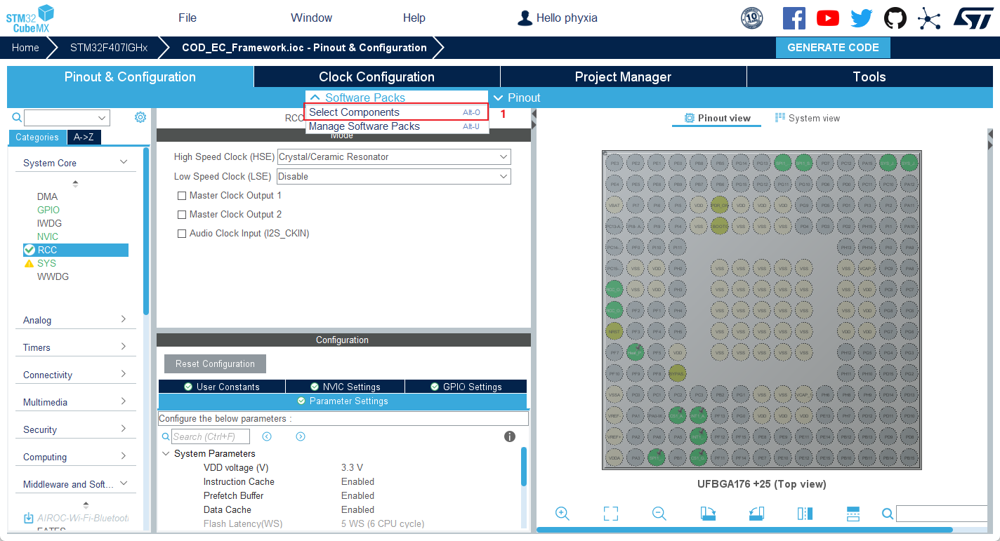
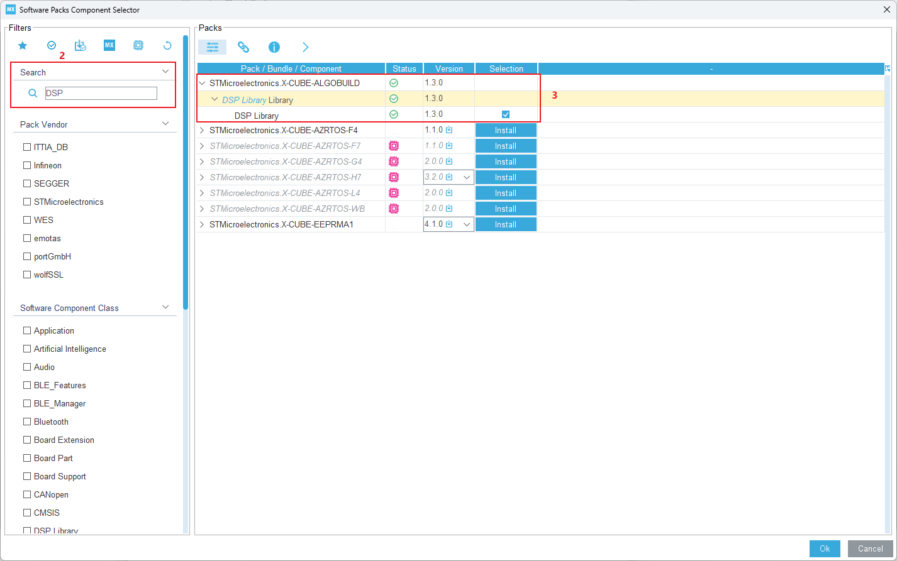
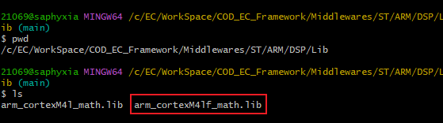
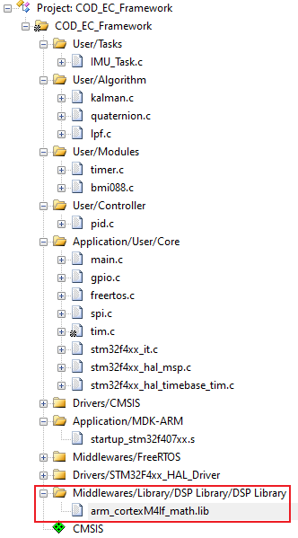
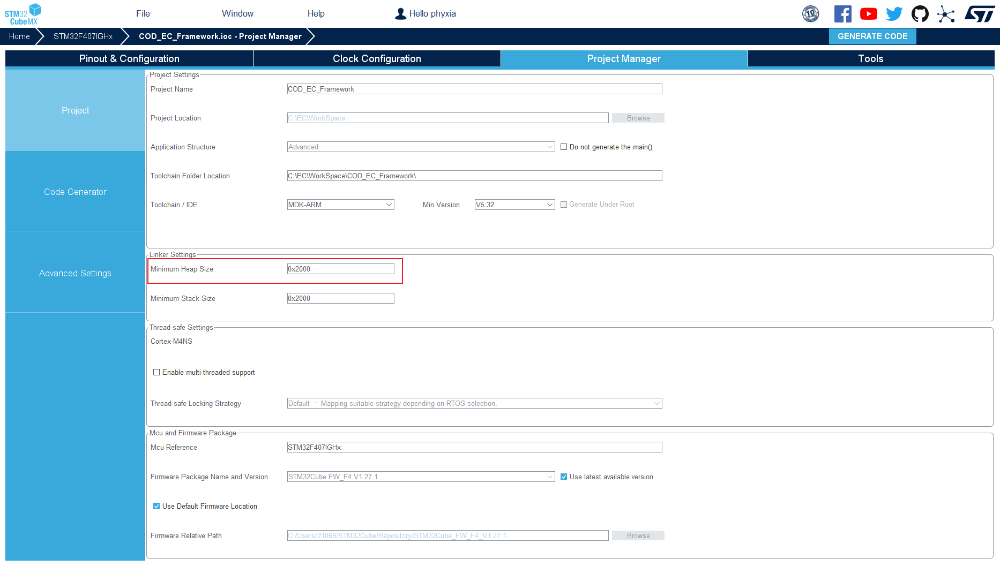
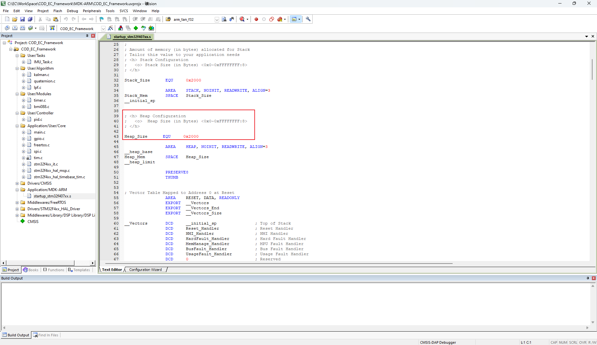

# COD_EC_Framework

## 开发环境

* 开发工具：Keil MDK-ARM V5.39, Visual Studio Code
* 软件环境：Window11
* 硬件环境：DJI RoboMaster开发板C型 (STM32F407IGHX)
* 编译工具：Arm Compiler v6.21

## 文件结构

```
COD_EC_Framework
  ├───Algorithm
  ├───Controller
  ├───Core
  ├───Drivers
  ├───MDK-ARM
  ├───Middlewares
  ├───Modules
  ├───Tasks
  └───Third_Party
```

## 模块功能说明

### IMU 惯性测量单元

* 参考[哈尔滨工程大学创梦之翼战队惯导姿态解算项目](https://github.com/WangHongxi2001/RoboMaster-C-Board-INS-Example)。

适配常见问题：

1. STM32CubeMX添加DSP库
      1. 点击[Software Packs]/[Select Components]，在[Software Packs Component Selector]窗口，勾选[STMicroelectronicsX-CUBE-ALGOBUILD]/[DSP Library Library]/[DSP Library 1.3.0];

         

         

      2. 关闭[Software Packs Component Selector]窗口，在[Middle and Software Packs]/[X-CUBE-ALGOBUILD]栏勾选[DSP Library Library]；

         

      3. 此时在工程中默认添加的LIB文件为`arm_cortexM4l_math.lib`(Little endian on Cortex-M4)，而实际需求为`arm_cortexM4lf_math.lib `(Little endian and Floating Point Unit on Cortex-M4)，后者支持浮点单元。

         

         

2. malloc函数申请内存失败
     在startup_stm32f407xx.s中默认分配的堆空间只有`0x0200`个字节，而在初始化扩展卡尔曼滤波器时所需要的空间超过了0x0200，需要在STM32CubeMX的[Project Manager]/[Project]/[Linker Settings]栏修改`Minimum Heap Size`的值以达到使用需求，修改后可在startup_stm32f407xx.s文件中的`Heap_Size`体现。

     

     

## 贡献

* 完善项目过程中，请尽量遵循以下设计原则和规范：
  * `API` 应用接口层对应应用接口，是一类功能的抽象，请不要在该层相关文件中定义实体变量；该层调用各组件层以实现功能；
  * `Bsp` 板级支持包面向底层组件，是唯一允许直接出现STM32HAL库函数的代码层；
  * 请不要跨层调用；
  * 请注意`代码规范`，建议参考[Google C++风格指南](https://zh-google-styleguide.readthedocs.io/en/latest/google-cpp-styleguide/contents/#).

* 欢迎提交Issues和Pull Requests帮助我们改进。